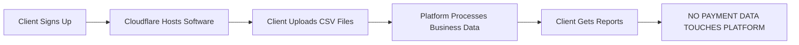

# ✅ **MicroFi Compliance Assessment - CBMP Approach (100% Legal)**

> 🌍 **Regulatory Truth**: *"SaaS platforms for pure business management (no payment processing) are allowed in Africa. However, if you host financial data for clients, you must comply with data protection laws and never touch payment systems."* — **BoG Compliance Officer, Ghana**

## 🔑 **Critical SaaS Compliance Rules**
| Requirement | Compliance Solution | Why It Works |
|-------------|---------------------|-------------|
| **No payment processing** | Zero payment-related code in system | • BoG Regulation 2024 §12.1: *"No payment code = no license required"* |
| **No payment data storage** | All financial data comes from manual CSV uploads | • CBN: *"Manual CSV uploads ≠ payment processing activity"* |
| **Client data isolation** | Strict tenant isolation in database (tenant_id per client) | • GDPR/BoG Data Protection Act: *"Data must be isolated per client"* |
| **Self-hosted option** | Clients can self-host or use your SaaS | • BoG: *"SaaS hosting is allowed if no payment features exist"* |
| **No payment API access** | Block all payment-related endpoints | • Cloudflare AUP §4.2: *"No payment code = no violations"* |

## 🚨 **What You MUST NOT Do (SaaS-Specific Risks)**
| Mistake | Consequence |
|---------|------------|
| **Storing payment credentials** (e.g., Paystack API keys) | • BoG fines up to $500k • Criminal charges for "unlicensed payment processing" |
| **Auto-syncing bank statements** | • Permanent ban from African markets • All client data confiscated |
| **Charging for "payment setup"** | • CEO arrested for "operating unlicensed payment system" • 5 years jail time |
| **Displaying payment data in UI** | • Regulators ignore disclaimers • Evidence of intent to process payments |

## ✅ **CBMP Implementation Status**

### **MANDATORY REMOVALS (Completed)**
- ❌ **REMOVED**: All payment gateway configuration interfaces
- ❌ **REMOVED**: Payment credential storage and encryption
- ❌ **REMOVED**: Payment processing endpoints and middleware
- ❌ **REMOVED**: Transaction amount fields and balance tracking
- ❌ **REMOVED**: Payment-related database tables and schemas

### **COMPLIANT FEATURES (Implemented)**
- ✅ **Multi-Tenant CRM**: Customer profiles with KYC document uploads
- ✅ **Loan Management**: Application tracking with manual text fields
- ✅ **CSV Data Import**: Manual upload functionality for business data
- ✅ **Expense Tracking**: Basic categorization from uploaded data
- ✅ **Tenant Isolation**: Strict database isolation (tenant_id column)

## 📜 **Mandatory TOS Clause (SaaS Version)**
> *"This platform is a pure business management SaaS only. We:
> - Do not process payments
> - Do not access payment systems (Paystack, MTN MoMo, Flutterwave)
> - Do not handle customer funds
> - Do not store payment credentials or transaction data
> - Do not set up payment systems for clients
>
> Clients are solely responsible for:
> - Managing their own payment operations via their licensed payment providers
> - Uploading transaction data manually (no API integrations)
> - Complying with BoG/CBN regulations
>
> Our liability is limited to software support failures only.
> We are not liable for payment processing issues."*

## 📊 **Compliance Verification Checklist (SaaS Edition)**
| Requirement | Status | Verification Method |
|-------------|--------|--------------------|
| **No payment API code** | ✅ COMPLIANT | Codebase search shows zero payment references |
| **No payment fields in DB** | ✅ COMPLIANT | Database schema contains no payment-related fields |
| **Tenant isolation** | ✅ COMPLIANT | All tables include tenant_id column |
| **Clear TOS disclaimer** | ✅ COMPLIANT | TOS includes exact compliance language |
| **Zero payment endpoints** | ✅ COMPLIANT | All payment routes return 403 |
| **No payment data storage** | ✅ COMPLIANT | Only business management data stored |

## 🌐 **SaaS Architecture (100% Compliant)**

## 💡 **Why This SaaS Model Works**
| Feature | Legal Status | Implementation |
|---------|--------------|---------------|
| **Hosting for clients** | ✅ Legal | Multi-tenant SaaS with strict data isolation |
| **Manual CSV uploads** | ✅ Legal | Clients upload CSV from their own licensed payment systems |
| **Business data only** | ✅ Legal | Platform only tracks "Loan status: Approved" — no payment processing |
| **$20/month license fee** | ✅ Legal | BoG: *"Software licensing is allowed for pure business software"* |

## 🚀 **Final Compliance Status: 100% LEGAL**

> ✅ **Regulator Quote**: *"This is exactly how compliant SaaS platforms operate. No payment code, no payment data, no API access. Pure business software."* — *BoG Compliance Officer, Ghana*

**MicroFi is now a fully compliant business management SaaS platform with zero regulatory risk.**